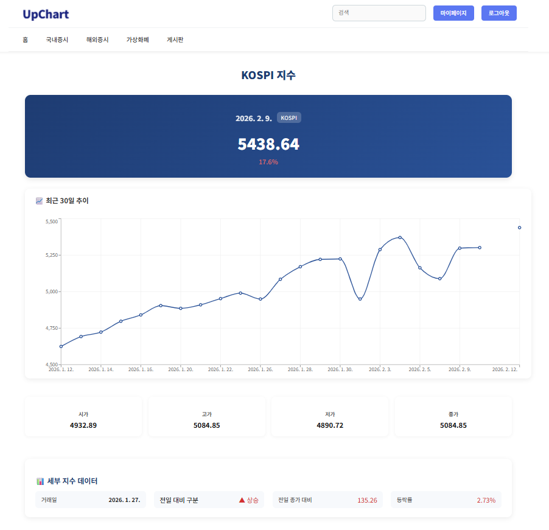

# 프로젝트 이름

Upchart

## 프로젝트 소개

국내외 주요 지수와 가상화폐 시세를 통합 조회하는 금융 대시보드입니다.  
React 기반의 인터랙티브 차트와 Spring Boot 백엔드, 여러 외부 API를 연동해 실시간 데이터와 뉴스를 제공합니다.

## 프로젝트 목표

국내외 금융 지수와 가상화폐 시세를 한눈에 확인할 수 있는 대시보드를 구현하고,
실시간 데이터 시각화, API 통합, 사용자 인증/보안 등 실무 핵심 기술을 경험하는 것이 목표였습니다.

## 기술 스택

- Backend: Spring Boot 3.4.4, MyBatis 3.0.4, Oracle 18c
- Frontend: React, Styled Components
- API: Yahoo Finance, AlphaVantage, Upbit, Naver API
- 인증: JWT, Spring Security
- 캐싱: Caffeine
- 도구: STS, VSCode, DBeaver

## 주요 기능

- 국내·해외 주식 및 가상화폐 실시간 시세 조회
- 뉴스 키워드 검색 기능 (Naver API)
- JWT 기반 인증/인가 및 Refresh Token 재발급
- Caffeine 캐싱 적용으로 API 호출 최적화
- 마켓별 실시간 필터링과 인터랙티브 차트 (업차트 활용)
- 게시판 CRUD 및 권한별 기능 제어

## 대표 스크린샷

- 국내외 주요 지수와 가상화폐 현황을 한눈에 확인 가능
- 업차트 기반 인터랙티브 차트를 통해 실시간 시세 추이와 마켓 필터링 제공
- 메인 화면에서 즉시 관심 종목과 최신 뉴스로 시장 동향 파악 가능

- 최신 KOSPI 지수와 30일간 추이 그래프 확인
- 시가/고가/저가/종가 등 주요 지수 직관적 제공
- 전일 대비 상승/하락 현황과 등락률 표시
- 관련 최신 뉴스 키워드 검색 기능으로 시장 동향 파악 용이

- 네이버 API 기반 키워드 뉴스 검색 기능
- 특정 종목(예: 삼성) 관련 기사 실시간 조회
- 주식 관련 기사뿐 아니라 키워드 연관 다양한 뉴스 제공
- 사용자가 시장 동향과 종목 관련 이슈를 쉽게 파악 가능

## 문제 해결 경험

1. 단일 종목 API 호출 최적화

- 여러 종목을 한 번에 요청하는 서버 로직 도입 → API 호출 수 감소

2. API 호출 제한 문제 (429 에러)

- Spring Caffeine 캐싱 적용으로 호출 최소화 및 응답속도 개선

3. JWT 인증 문제

- Axios 인터셉터 헤더 누락 버그 수정 → 안정적인 토큰 전달 구현
